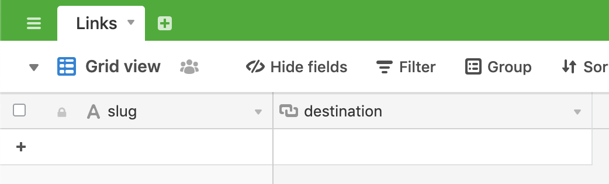

# AirTable Based Link Shortener

## Setup

Please make sure your AirTable is setup exactly like the one in the following screenshot:

Please also grab the AirTable API Key & Base Key from the API documentations. Head [here](https://airtable.com/api) and click on the base you just created to get started.

Set `AIRTABLE_BASE` to your Base Key, and `AIRTABLE_KEY` to your API Key.
Set `API_KEY` to a passphrase or key that only you know.

## Routing

All links will be routed through a 302 (Temporary Redirect) because you're using AirTable. Simply visit `example.com/slug` to get redirected.

## Using the API

You can make changes the database easily with the API.

### `/api/trace`
Find where a slug points to without getting redirected.

#### Parameters
* `slug` (required) - the slug you're looking up.

#### Result
* `dest` - the destination URL.
* `error` - the error message, if exists.
* `status` - status code of the request

### `/api/push`
Make changes to a specific record.

#### Parameters
* `auth` (required) - the `API_KEY` environment variable, used for authentication.
* `dest` (optional) - the destination URL you're pointing to. Must exist if `slug` does not exist.
* `slug` (optional) - the slug you're making changes to. If it does not exist, a random slug will be generated. Must exist if `dest` does not exist.

#### Result
* `error` - the error message, if exists.
* `status` - status code of the request

## License

ABLS is released under [the MIT license](LICENSE).